# 📖 Pipex | 42 School Project

### Recreating the Unix pipe functionality, because shell redirections are too mainstream! 😄


> *"Why use the terminal's pipes when you can code your own?"* - Every 42 Student Ever 😎

---

## 🎯 Project Overview

Welcome to my implementation of `pipex`, a program that simulates the functionality of shell pipes. This project explores process creation, inter-process communication, file descriptors, and command execution in Unix-like systems.

### 🌟 Key Features

- Recreates the behavior of the shell command: `< file1 cmd1 | cmd2 > file2`
- Handles multiple pipes and commands (Bonus)
- Supports here_doc functionality (Bonus)
- Uses efficient process management with fork and execve
- Includes robust error handling for various edge cases
- Norm-compliant and well-structured code

---

## 📜 Mandatory Requirements

### **Behavior**
- **Command Format**: `./pipex file1 cmd1 cmd2 file2`
- **Functionality**: Executes `cmd1` with input from `file1`, pipes the output to `cmd2`, and redirects the final output to `file2`
- **Equivalent Shell Command**: `< file1 cmd1 | cmd2 > file2`
- **Error Handling**: Manages errors for file permissions, invalid commands, and system call failures

### **System Calls Used**
- **`pipe()`**: Creates a unidirectional data channel for inter-process communication
- **`fork()`**: Creates a new process by duplicating the calling process
- **`execve()`**: Executes a program specified by a path
- **`dup2()`**: Duplicates a file descriptor to another file descriptor
- **`wait/waitpid()`**: Waits for a child process to terminate, and collect its status for waipid
- **`access()`**: Checks file accessibility
- **`open()`**: Opens files for reading or writing
- **`close()`**: Closes file descriptors

---

## 📋 Supported Use Cases

- Basic piping of two commands
- Handling input and output redirections
- Command execution with arguments and flags
- Environment variable resolution for command paths
- Error handling for non-existent files, permission issues, or invalid commands

### Example: **Basic Usage**
```bash
./pipex infile "ls -l" "wc -l" outfile
```
This is equivalent to:
```bash
< infile ls -l | wc -l > outfile
```

---
# Mandatory Workflow

### Detailed visualization and explanation of the Pipex workflow


### **1. Program Initialization**
```c
check_args(ac);
path_arr = get_env_arr(env);
```
- **Visual**:
  ```
  [START]
     │
     ▼
  Check argc == 5?
     │
     ▼
  Extract PATH from env
  ┌───────────────┐
  │  PATH parsing │
  └───────────────┘
  ```
- **Why**: Ensures correct usage and finds command paths
- **If Missing**: Invalid arguments would cause undefined behavior

---

### **2. Pipe Creation**
```c
pipe(fds);
```
- **Visual**:
  ```
  Process
  ┌───────────────────────┐
  │  pipe() → [0] [1]     │
  └───────────────────────┘
  ```
- **Why**: Creates communication channel between processes
- **If Missing**: Commands can't exchange data

---

### **3. First Child Process**
```c
pid[0] = fork();
call_child_p(...);
```
- **Visual**:
  ```
  Parent
  ┌───────────────┐
  │     fork()    ├──┐
  └───────────────┘  │
                     ▼
                   Child1
  ┌────────────────────────────┐
  │  dup2(infile)              │
  │  dup2(pipe[1])             │
  │  execve(cmd1)              │
  └────────────────────────────┘
  ```
- **Why**: Handles input redirection and first command
- **If Missing**: No command execution chain starts

---

### **4. Second Child Process**
```c
pid[1] = fork();
call_parent_p(...);
```
- **Visual**:
  ```
  Parent
  ┌───────────────┐
  │     fork()    ├──┐
  └───────────────┘  │
                     ▼
                   Child2
  ┌────────────────────────────┐
  │  dup2(pipe[0])             │
  │  dup2(outfile)             │
  │  execve(cmd2)              │
  └────────────────────────────┘
  ```
- **Why**: Handles output redirection and final command
- **If Missing**: No result capture

---

### **5. Pipe Management**
```c
close(fds[0]); 
close(fds[1]);
```
- **Visual**:
  ```
  Before: Parent → [pipe[0]][pipe[1]] 
  After:  Parent → [  CLOSED  ]
  ```
- **Why**: Prevents resource leaks
- **If Missing**: File descriptor exhaustion

---

### **6. Process Waiting**
```c
waitpid(pid[0], ...);
waitpid(pid[1], ...);
```
- **Visual**:
  ```
  Parent
  ┌───────────────────────┐
  │  wait()               │
  │  wait()               │
  └───────────────────────┘
  ```
- **Why**: Avoids zombie processes
- **If Missing**: Zombie processes remain

---

### **Flowchart**
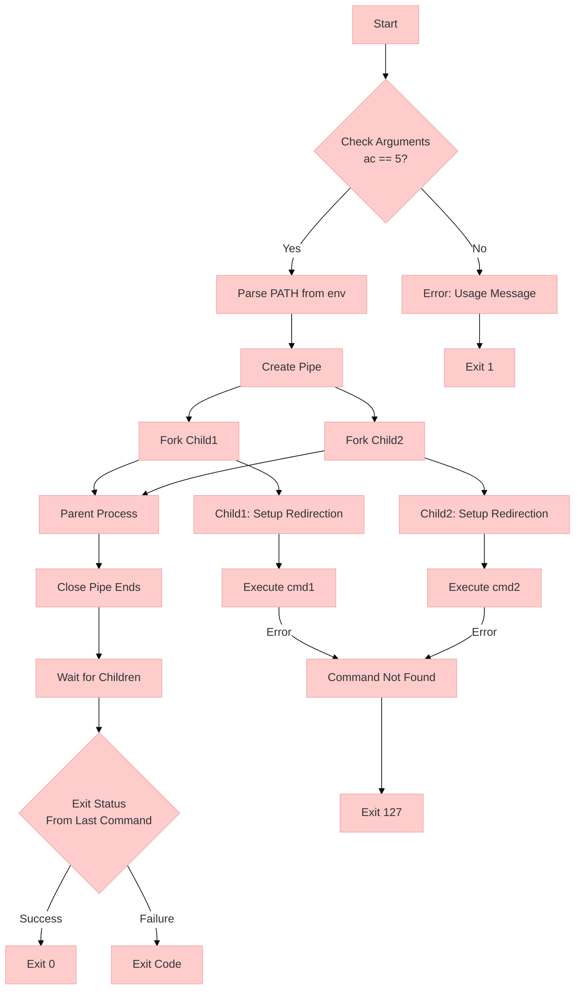

### **Key Flow Explanation**
1. **Argument Check**: Gatekeeper for valid input
2. **PATH Parsing**: Foundation for command execution
3. **Pipe Creation**: Creates data highway between processes
4. **Child Processes**: Parallel execution units
5. **Redirection**: File descriptor manipulation magic
6. **Command Execution**: Core functionality
7. **Cleanup**: Critical for resource management

---

# Detailed FlowChart

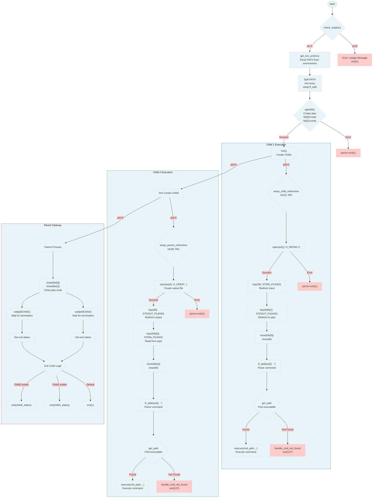
---

### Key System Call Details:
1. **pipe(fds)**  
   - Creates 2 file descriptors:  
     - `fds[0]`: Read end of pipe  
     - `fds[1]`: Write end of pipe  

2. **fork()**  
   - Creates child process:  
     - Returns 0 in child  
     - Returns PID in parent  
   - Creates identical memory copy  

3. **dup2(old, new)**  
   - Redirects file descriptors:  
     - `dup2(fd, 0)`: Replace stdin  
     - `dup2(fd, 1)`: Replace stdout  

4. **execve(path, args, env)**  
   - Replaces current process with new program  
   - Needs absolute path to executable  
   - Inherits file descriptors  

5. **waitpid(pid, &status, 0)**  
   - Suspends parent until child exits  
   - Status contains exit code  
   - Prevents zombie processes  

### Error Handling Flow:
- **Red boxes** indicate error states
- All syscalls check for return value < 0
- Error messages use `perror()` for context
- Memory cleanup happens before exit
- Exit codes follow shell conventions

### Data Flow:
1. Input file → Child1 (via STDIN)  
2. Child1 output → Pipe (via STDOUT)  
3. Pipe → Child2 input (via STDIN)  
4. Child2 output → Output file (via STDOUT)  

This diagram shows the complete lifecycle of the program, including all major system calls, error conditions, and memory management operations. Each decision point represents potential error conditions that must be handled according to POSIX standards.


----

# Syscalls FlowChart 

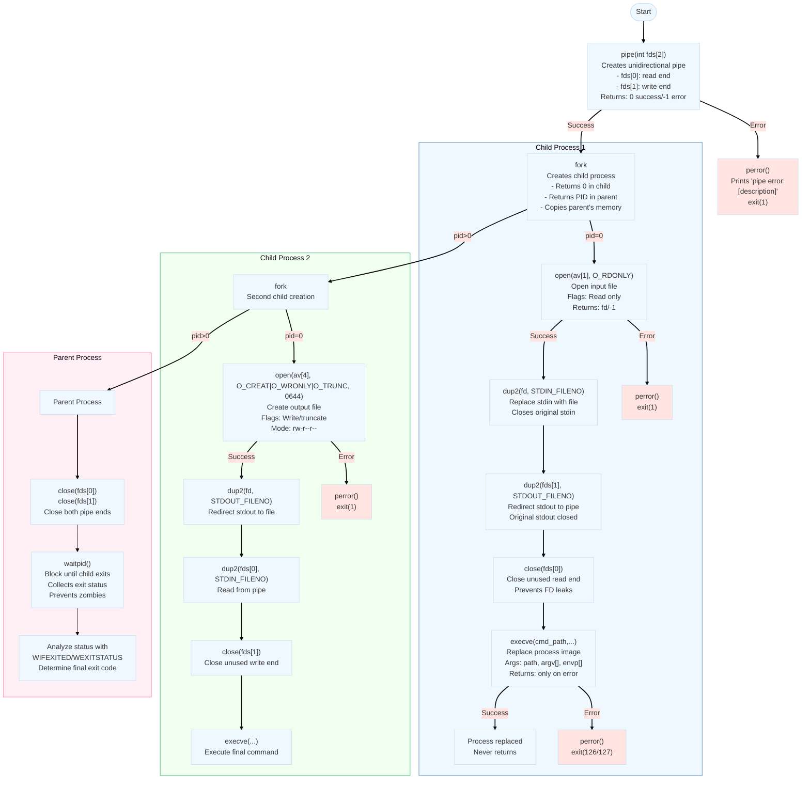

### System Call Details Breakdown:

1. **`pipe(int fds[2])`**
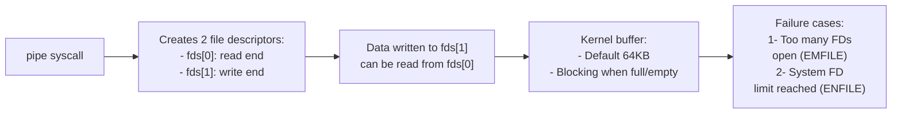

2. **`fork()`**
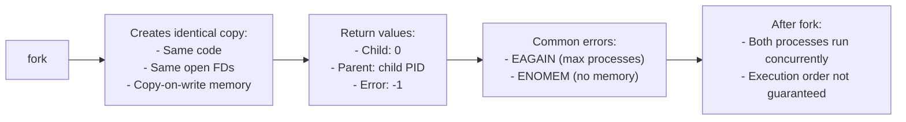

3. **`dup2(int oldfd, int newfd)`**
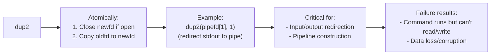

4. **`execve(const char *path, char *const argv[], char *const envp[])`**
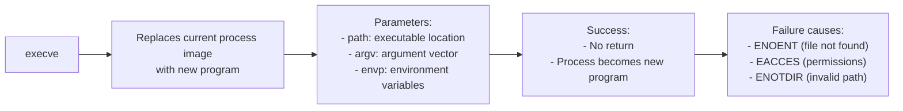

5. **`waitpid(pid_t pid, int *status, int options)`**
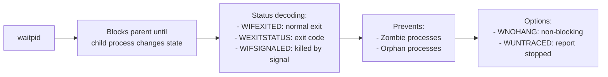

### Process Lifecycle Flow:
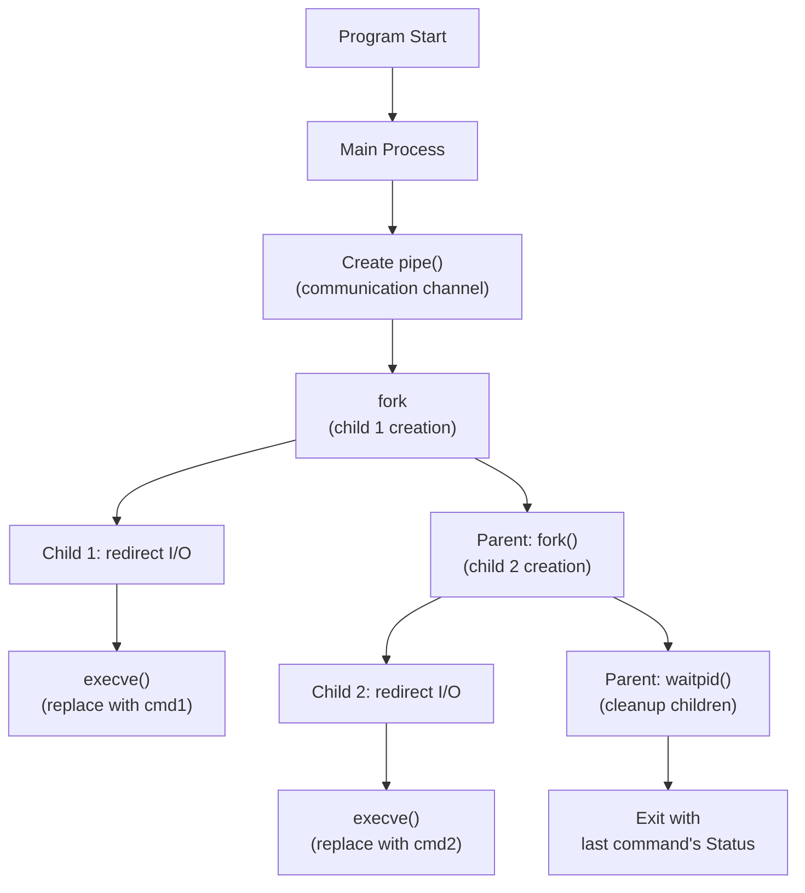

---

# Fork can be chellenging to understand here is some inf about it

### **1. `fork()` System Call Fundamentals**

**What Happens During fork():**
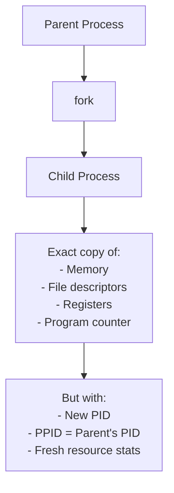

### **2. Memory Copy Mechanism**

**Traditional Approach (Historical):**


**Modern Copy-on-Write (COW):**
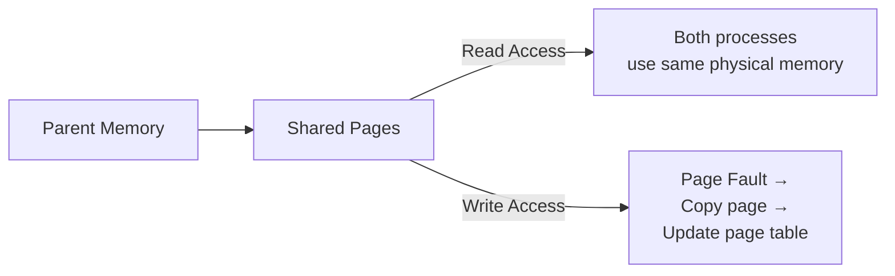

### **3. Copy-on-Write (COW) Deep Dive**

**Mechanism:**
1. **Initial State:**
   ```c
   Parent: var = 42  // Physical address 0x1000
   Child:  var = 42  // Also points to 0x1000 (read-only)
   ```
2. **Write Operation:**
   ```c
   Child: var = 100  // Triggers page fault
   ```
3. **Kernel Action:**
   ```c
   Allocate new page at 0x2000
   Copy 0x1000 → 0x2000
   Update child's page table
   Set both pages to read/write
   ```

**Visual Timeline:**
```mermaid
gantt
    title COW Memory Timeline
    dateFormat  HH:mm:ss
    section Parent
    Write var=42      :a1, 00:00:00, 1s
    Continue execution :after a1, 5s
    section Child
    Read var=42       :a2, 00:00:01, 1s
    Write var=100     :a3, 00:00:02, 1s
    section Kernel
    Page Copy         :a4, 00:00:02, 1s
```

### **4. Practical Examples**

**Example 1: Memory Sharing Demonstration**
```c
#include <stdio.h>
#include <unistd.h>

int main() {
    int var = 42;
    pid_t pid = fork();

    if (pid == 0) { // Child
        printf("Child Before: %p → %d\n", &var, var);
        var = 100;
        printf("Child After:  %p → %d\n", &var, var);
    } else { // Parent
        sleep(1); // Let child modify first
        printf("Parent Value: %p → %d\n", &var, var);
    }
    return 0;
}
```

**Output Analysis:**
```
Child Before: 0x7ffd4a3e4a5c → 42
Child After:  0x7ffd4a3e4a5c → 100
Parent Value: 0x7ffd4a3e4a5c → 42
```

**Visual Explanation:**
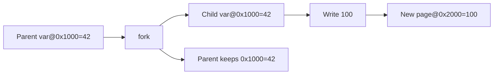

**Example 2: Memory Intensive Test**
```c
#include <stdio.h>
#include <stdlib.h>
#include <unistd.h>
#define SIZE 100000000 // 100MB

int main() {
    int *big_array = malloc(SIZE * sizeof(int));
    
    printf("Parent allocated 100MB\n");
    pid_t pid = fork();
    
    if (pid == 0) {
        printf("Child sleeping (shared pages)\n");
        sleep(5);
        big_array[0] = 1; // Trigger COW
        printf("Child modified array\n");
        sleep(5);
    } else {
        sleep(10);
    }
    return 0;
}
```

**Memory Usage Observation:**
```mermaid
gantt
    title Memory Usage Timeline
    dateFormat  HH:mm:ss
    section Memory
    Parent allocates 100MB :00:00:00, 3s
    fork() happens          :00:00:03, 1s
    Shared pages            :00:00:04, 2s
    Child modifies array    :00:00:06, 1s
    Total memory ~200MB     :00:00:07, 3s
```

### **5. Key Characteristics Table**

| Feature                | Traditional fork()          | Copy-on-Write fork()        |
|------------------------|-----------------------------|------------------------------|
| Memory Usage           | Immediate double memory     | Only modified pages copied   |
| Fork Speed             | Slow (full copy)            | Fast (only metadata)         |
| First Write Penalty    | None                        | Page fault + copy overhead   |
| Best For               | Immediate exec() scenarios  | Long-running child processes |
| Memory Overcommit      | Impossible                  | Possible                     |

### **6. Performance Tests**

**Test 1: Fork Speed Comparison**
```bash
# COW system (Linux)
$ time ./fork_test  # With 1GB allocation
real 0m0.003s

# Non-COW system (Hypothetical)
$ time ./fork_test  
real 0m0.452s  # Actual memory copy time
```

**Test 2: Page Fault Monitoring**
```bash
# Watch page faults during COW
$ /usr/bin/time -v ./cow_test
Major (requiring I/O) page faults: 1
Minor (reclaiming frame) page faults: 512
```

### **7. When COW Fails**

**Edge Case 1: Memory Overcommit**
```c
int *huge = malloc(10 * 1024 * 1024 * 1024L); // 10GB
fork(); // May fail even if physical RAM < 10GB
```

**Edge Case 2: Hardware Limitations**
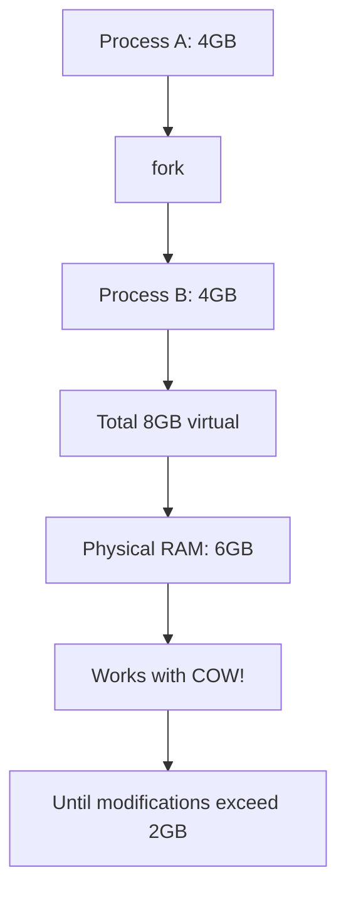

### **8. Real-World Impact Example**

**Web Server Scenario:**
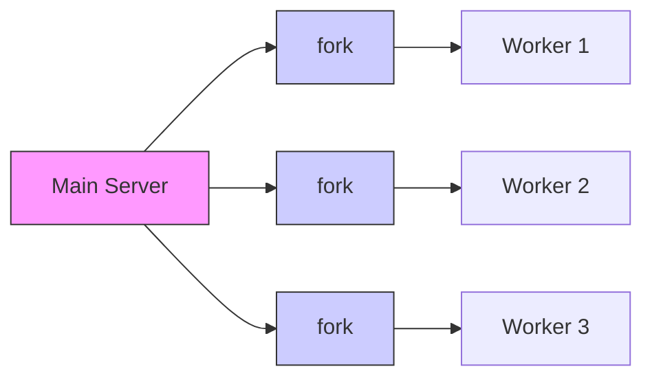

**Without COW:**
- 4 processes × 1GB = 4GB (actual allocation)

**With COW:**
- 4 processes × 1GB = ~1GB (shared pages until modification)

### **9. Advanced Verification Tools**

**1. Check Page References:**
```bash
$ sudo cat /proc/[pid]/smaps | grep -i cow
```

**2. Monitor Page Faults:**
```bash
$ perf stat -e page-faults ./my_program
```

**3. Memory Usage Analysis:**
```bash
$ ps -o pid,rss,vsz,minflt,majflt [pid]
```

### **10. Key Takeaways**

1. **COW Optimization:**
   - Only copies modified memory pages
   - Dramatically reduces fork() overhead
   - Enabled by virtual memory hardware

2. **Implications:**
   - **Security**: Processes are still fully isolated
   - **Performance**: Fast fork() even with large memory
   - **Resource**: Efficient memory usage

3. **Best Practices:**
   - Avoid unnecessary writes after fork()
   - Use vfork() if immediately calling exec()
   - Monitor major page faults in performance-critical apps

---

## 💻 Bonus Requirements

### **Additional Features**
- **Multiple Pipes**: Handles any number of commands: `./pipex file1 cmd1 cmd2 cmd3 ... cmdn file2`
- **Here_doc Support**: Implements the behavior of `<<` and `>>` operators:
  ```bash
  ./pipex here_doc LIMITER cmd1 cmd2 ... cmdn file
  ```
  This is equivalent to:
  ```bash
  cmd1 << LIMITER | cmd2 >> file
  ```

### Example: **Multiple Commands**
```bash
./pipex infile "grep hello" "sed s/hello/world/" "wc -w" outfile
```

### Example: **Here_doc Usage**
```bash
./pipex here_doc EOF "grep hello" "wc -l" outfile
```

---

## 🔄 Process Flow

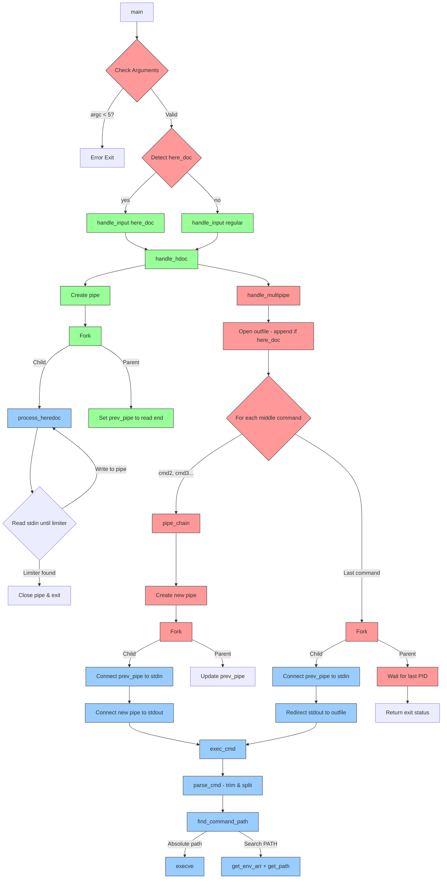

### Key Function Explanations:

1. **handle_hdoc** (tools_bonus.c)
```c
void handle_hdoc(char *limiter, int *prev_pipe)
```
- **Input**: Limiter string, pointer to previous pipe
- **Process**:
  - Creates pipe
  - Forks child to read stdin until limiter+newline
  - Parent sets `*prev_pipe` to pipe's read end
- **Exit Conditions**:
  - Pipe error → exit(1)
  - Fork error → exit(1)
  - Limiter comparison failure → keeps reading

2. **pipe_chain** (pipex_bonus.c)
```c
static void pipe_chain(char *cmd, int *prev_pipe, char **env)
```
- **Input**: Command string, previous pipe fd, environment
- **Process**:
  - Creates new pipe
  - Forks child to:
    - Connect previous pipe to stdin
    - Connect new pipe to stdout
    - Execute command
  - Parent updates `*prev_pipe` to new pipe's read end
- **Exit Conditions**:
  - Pipe/fork error → exit(1)
  - Command not found → exit(127)

3. **exec_cmd** (tools_bonus.c)
```c
void exec_cmd(char *cmd, char **env)
```
- **Input**: Raw command string, environment
- **Process**:
  1. parse_cmd:
     - Trim surrounding quotes
     - Split by spaces (respecting quotes)
  2. find_command_path:
     - Check absolute/relative path
     - Search PATH if needed
  3. Execute with execve
- **Exit Codes**:
  - 127: Command not found
  - 126: Permission denied
  - 1: Critical error

4. **handle_multipipe** (pipex_bonus.c)
```c
pid_t handle_multipipe(int ac, char **av, char **env, int hdoc)
```
- **Input**: Argument count/array, env, here_doc flag
- **Process**:
  - Open output file (append mode for here_doc)
  - Create pipe chain for middle commands
  - Handle final command separately
- **Return**: PID of last process

### Critical Error Points:
1. **Here-doc Limiter Match** (process_heredoc):
   - Current code: `ft_strncmp(line, expected, ft_strlen(line))`
   - Problem: May match partial limiter
   - Fix: `ft_strncmp(line, expected, ft_strlen(expected))`

2. **Command Parsing** (parse_cmd):
   - Current code: Simple space splitting after trimming
   - Problem: Fails for `echo "hello world"`
   - Fix: Implement quote-aware parsing

3. **Exit Code Propagation**:
   - Final exit code comes from last command
   - Middle command failures not detected
   - Shell behavior difference: Fails fast on errors
----

## execution flow and system call interactions

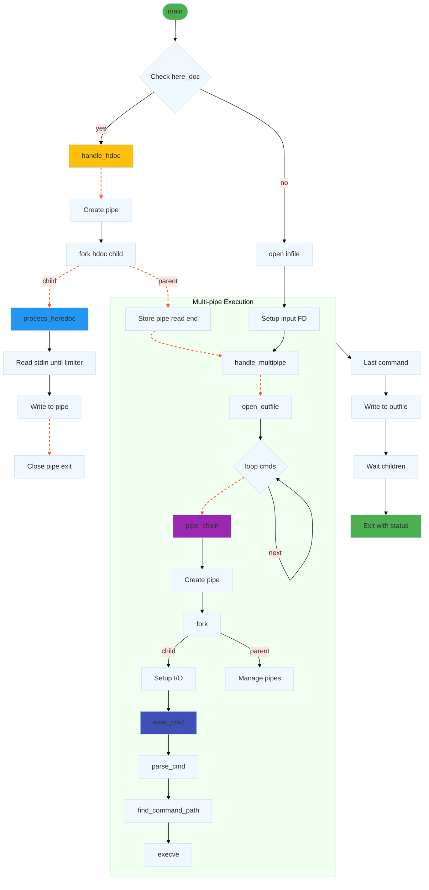

### Detailed Breakdown of helper functions 

**1. here_doc Handling**
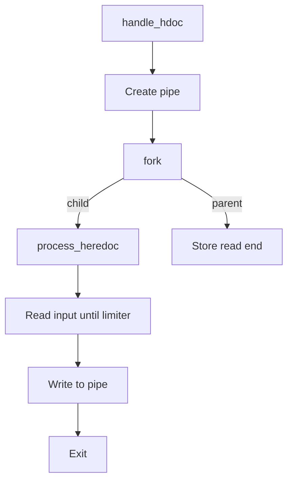

**2. Pipe Chain Execution**
```mermaid
flowchart TD
    A[pipe_chain] --> B[Create pipe]
    B --> C[fork]
    C -->|child| D[Close read end]
    D --> E[Connect prev_pipe to stdin]
    E --> F[Connect new pipe to stdout]
    F --> G[exec_cmd]
    C -->|parent| H[Close write end]
    H --> I[Update prev_pipe]
```

**3. Command Execution**
```mermaid
flowchart TD
    A[exec_cmd] --> B[parse_cmd]
    B --> C[Trim quotes]
    C --> D[Split args]
    A --> E[find_command_path]
    E --> F{Is absolute path?}
    F -->|yes| G[Verify executable]
    F -->|no| H[Search PATH]
    A --> I[execve]
```

### Key System Calls

1. **pipe()**
```mermaid
flowchart LR
    A[pipe] --> B[Create 2 FDs]
    B --> C[Data flow: write → read]
```

2. **fork()**
```mermaid
flowchart LR
    A[fork] --> B[Parent: PID]
    A --> C[Child: 0]
```

3. **dup2()**
```mermaid
flowchart LR
    A[dup2 old , new] --> B[Close new FD]
    B --> C[Copy old → new]
```

4. **execve()**
```mermaid
flowchart LR
    A[execve] --> B[Replace process]
    B --> C[Run new program]
```

### Error Handling Path
```mermaid
flowchart TD
    A[Error] --> B[perror]
    B --> C[free_all]
    C --> D[exit]
    style A fill:#FF5722
    style B fill:#FF5722
```

### Flow Characteristics

1. **Multi-pipe Architecture**
```mermaid
flowchart LR
    in([Input]) --> cmd1 --> pipe1 --> cmd2 --> pipe2 --> cmd3 --> out([Output])
    style pipe1,pipe2 fill:#F8BBD0
```

2. **FD Management**
```mermaid
flowchart TD
    A[Parent] --> B[Keep all pipes open]
    B --> C[Children close unused FDs]
```

3. **Memory Lifecycle**
```mermaid
flowchart TD
    A[parse_cmd] --> B[Alloc]
    B --> C[exec_cmd]
    C --> D[Free in child]
```
-----

## 🚀 Getting Started

### Installation
#### 1. Clone the repository:
```bash
git clone https://github.com/yomazini/42cursus-Pipex.git
```
#### 2. Navigate to the project directory:
```bash
cd 42cursus-Pipex
```
#### 3. Compile the program:
```bash
make
```
or
```bash
make bonus
```

### Usage
#### Basic syntax:
```bash
./pipex file1 cmd1 cmd2 file2
```

#### With multiple commands (bonus):
```bash
./pipex file1 cmd1 cmd2 cmd3 ... cmdn file2
```

#### With here_doc (bonus):
```bash
./pipex here_doc LIMITER cmd1 cmd2 ... cmdn file
```

---

## 💡 Implementation Details

### Core Components
- **Main Function**: `pipex()`
- **Helper Functions**:
  - `execute_command()`: Sets up redirections and executes commands
  - `create_pipes()`: Manages pipe creation for inter-process communication
  - `handle_here_doc()`: Processes the here_doc functionality (bonus)
  - Utility functions for parsing commands, finding paths, and error handling

### Process Management
- Parent process orchestrates the pipe creation and child process execution
- Child processes execute individual commands with redirected inputs/outputs
- Proper file descriptor management to avoid leaks and conflicts

### Error Handling
- Checks for file existence and permissions
- Validates command paths and executability
- Manages system call failures gracefully
- Provides meaningful error messages

---

## 🔬 Testing

### Recommended Tests
1. **Basic Pipe Test**:
   ```bash
   ./pipex infile "ls -l" "wc -l" outfile
   ```
   Compare with:
   ```bash
   < infile ls -l | wc -l > outfile
   ```

2. **Command Not Found Test**:
   ```bash
   ./pipex infile "ls -l" "invalid_command" outfile
   ```

3. **File Permissions Test**:
   - Create a file without read permission and try to use it as input
   - Create a file without write permission and try to use it as output

4. **Multiple Commands Test** (Bonus):
   ```bash
   ./pipex infile "grep hello" "sed s/hello/world/" "sort" "uniq" outfile
   ```

5. **Here_doc Test** (Bonus):
   ```bash
   ./pipex here_doc EOF "grep hello" "wc -l" outfile
   ```

### Edge Cases
- Empty files as input
- Commands with multiple arguments and quotes
- Very large outputs
- Commands that fail with specific error codes

---

## 🏆 What I Learned
- Process creation and management in Unix-like systems
- Inter-process communication using pipes
- File descriptor manipulation and redirection
- Command execution and environment handling
- Signal handling and zombie process prevention
- Handling complex I/O operations systematically

---

## 🔬 Under the Hood

### How `pipex` Works:
1. Parses command-line arguments
2. Creates pipes for inter-process communication
3. Forks child processes for each command
4. Sets up appropriate input/output redirections
5. Executes commands using the system's program loader
6. Manages resources and handles errors appropriately

### Key Challenges:
- Managing file descriptors correctly to avoid leaks
- Ensuring proper process termination and zombie prevention
- Handling the path resolution for command execution
- Implementing the here_doc functionality efficiently

---

## 🤝 Contribution
Feel free to:
- Open issues
- Submit pull requests
- Provide feedback

---

## 🎭 Author

Made with ☕️ and perseverance by **Youssef Mazini** (ymazini)
- 42 Intra: [ymazini](https://profile.intra.42.fr/users/ymazini)
- GitHub: [yomazini](https://github.com/yomazini)

---

> *"Piping hot code, connecting commands like never before!"* 😄

